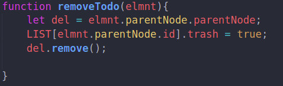

---
# TODO-APP
---

# Links

Start using the app [[click
me]{.ul}](https://soft-lolly-eb12c1.netlify.app/)

# how to create a task

the task is an object stored in an array (LIST)

when the user hit the key Enter the function addTodo() will be executed
.

to store the item created we gonna push the object to the LIST , by
default the properties done and trash will be set to false cuz the task
isn't done yet or deleted .

we need to increase the value of the id every time we create a new
element so it stays unique .

## the function addTodo()

the function addTodo() takes as parameters the value of the input which
is the task's content , id , a boolean if the task is done or not , and
an other boolean if it's deleted or not.

the function's gonna test if the " trash" parameter is set to true or
false , if it's true there's no need to run the code below cuz the task
doesn't exit anymore.

if the task exists , the function will check if it is completed or not
and it will change the style of the icon and the text by setting the
convenient classes.

you may ask why do we need to check all of this , isn't by default the
values of done and trash are set to "fasle" , YES but we will need this
function to display the tasks stored in the array LIST when we refresh
the page , in this case we have to check if some tasks are completed or
deleted .

# complete a task

the function completeTodo() gonna set the right classes when the task is
completed or canceled , and update the property done.

# delete a task 

this function will modify the property trash and set it to true , then
delete the item selected .

# Execution

both functions completeTodo() and removeTodo() will be executed when the user clicks on any item of the list \<ul\>\....\</ul\>. so we set the attribute job to the elements inside every \<li\>\...\</li\> which will take value of either complete in the check icon and delete in the trash icon.

# storing data in local storage 

to store data in local storge we need to set an item with a key and
value , the key here is "Todo" and the value it's our LIST converted to
a string under a json format .We will place this line of code in every
section where LIST is modified , so it'll be when we first create a task
and when it's completed or deleted.

# Loading data from the local storage

to load our data we need to get our item from the local storage with the
same key "Todo" that we set before

if the data exists we will display it by using the function loadTodo()

and the id will take the last value which is the LIST length so we will
continue adding new tasks without losing the id .

else if the data doesn't exist that means it's either our first time
using the app or we have cleared the current content .

# clear storage

and to clear all the tasks we need to add a function that will clear the
storage and reload the page .

# what did i learn from this project

before starting this project i've already tried to make a todo app in a
very traditional way , i was literally just messing around , but working
on this one gave me the opportunity to adapt a new method of solving
problems , by dividing the main issue into very small parts and solving
each one by using functions , and including the concept of objects
improved the organization of work and made it more simple and precise.
As a beginner ,finishing this project and writing this documentation
took some time and effort on my part ,I hope that by looking at and
testing this program, you may discover something useful today , and
thank you for your time and attention .

*Keep coding and have a great day !*
